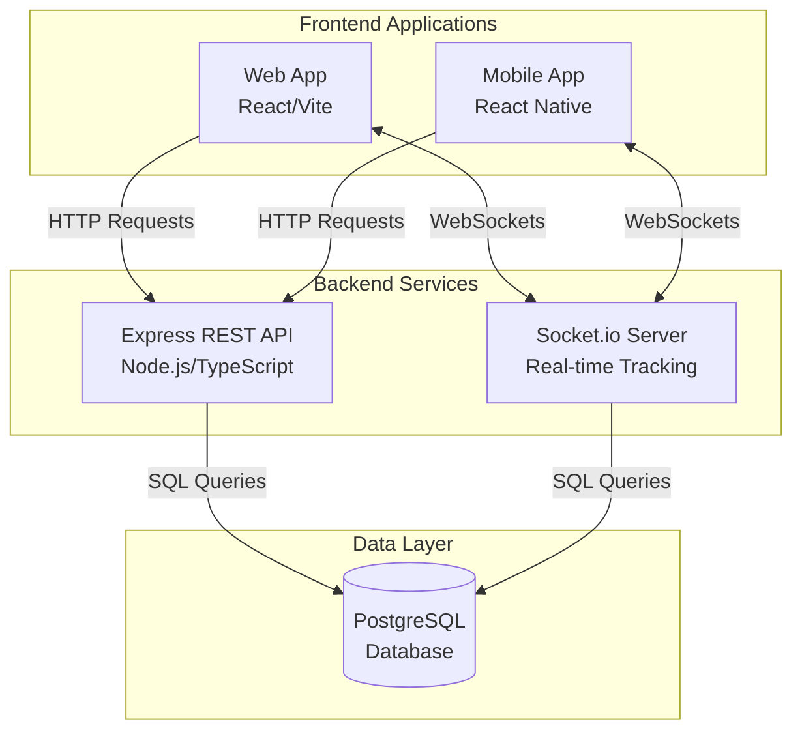
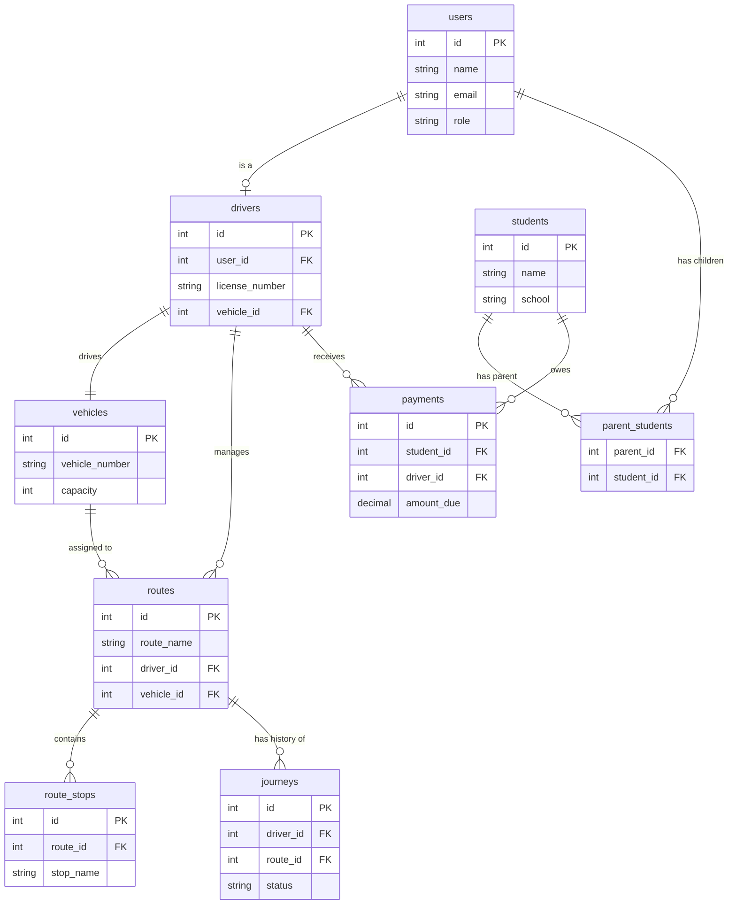

# Developer Guide: School Van Management System

Welcome to the School Van Management System developer guide! This document provides all the necessary information for developers to set up the environment, understand the architecture, and start contributing to the project.

---

## 1. System Architecture

The application is built using a modern, full-stack TypeScript architecture.



It consists of three main components:

- **Backend (`code/backend`)**: A Node.js and Express server that handles business logic, real-time tracking, and database interactions.
- **Web Frontend (`code/frontend`)**: A React application powered by Vite, serving as the main interface for Administrators, Drivers, and Parents.
- **Mobile Application (`code/mobile`)**: A React Native (Expo) application providing mobile access for drivers and parents.

### Technology Stack
- **Database**: PostgreSQL
- **Backend**: Node.js, Express.js, TypeScript, Socket.io (for real-time tracking)
- **Frontend**: React 19, Vite, Tailwind CSS, Lucide React (Icons), React Router
- **Mobile**: React Native, Expo

### Database Entity-Relationship Diagram (ERD)



---

## 2. Prerequisites

Before setting up the project locally, ensure you have the following installed on your machine:
- **Node.js**: v18.0 or higher
- **npm**: v9.0 or higher
- **PostgreSQL**: v14.0 or higher
- **Git**: For version control

---

## 3. Local Environment Setup

### 3.1. Clone the Repository
```bash
git clone https://github.com/cepdnaclk/e22-co2060-School-Van-Management-System.git
cd e22-co2060-School-Van-Management-System
```

### 3.2. Database Setup
1. Open PostgreSQL (using `psql` or pgAdmin) and create a new database:
   ```sql
   CREATE DATABASE schoolvan_db;
   ```
2. The database schema migrations are handled automatically by the backend via `migrate.ts` using the SQL files located in `code/backend/src/sql/`.

### 3.3. Backend Setup
1. Navigate to the backend directory:
   ```bash
   cd code/backend
   ```
2. Install dependencies:
   ```bash
   npm install
   ```
3. Create a `.env` file in the `code/backend` directory and add the following variables:
   ```env
   PORT=5000
   DB_USER=postgres
   DB_PASSWORD=your_postgres_password
   DB_HOST=localhost
   DB_PORT=5432
   DB_NAME=schoolvan_db
   JWT_SECRET=your_super_secret_jwt_key
   JWT_EXPIRES_IN=8h
   ```
4. Start the backend development server (this will automatically run database migrations):
   ```bash
   npm run dev
   ```

### 3.4. Web Frontend Setup
1. Open a new terminal and navigate to the frontend directory:
   ```bash
   cd code/frontend
   ```
2. Install dependencies:
   ```bash
   npm install
   ```
3. Start the Vite development server:
   ```bash
   npm run dev
   ```
4. The web application will be accessible at `http://localhost:5173`.

### 3.5. Mobile App Setup (Optional)
1. Open a new terminal and navigate to the mobile directory:
   ```bash
   cd code/mobile
   ```
2. Install dependencies:
   ```bash
   npm install
   ```
3. Start the Expo server:
   ```bash
   npx expo start
   ```

---

## 4. Project Structure

### Backend (`code/backend/src/`)
- `/controllers`: Handles HTTP requests and maps them to services.
- `/services`: Contains core business logic and database queries.
- `/routes`: Defines Express API endpoints and attaches middleware.
- `/sql`: Contains raw `.sql` files for database schema migrations.
- `/sockets`: Manages Socket.io real-time events (e.g., live van tracking).
- `/middleware`: Authentication and error-handling middleware.

### Frontend (`code/frontend/src/`)
- `/components`: Reusable UI components (buttons, layout, sidebars).
- `/pages`: Full-page React components mapped to routes (Admin, Driver, Parent).
- `/services`: API wrapper functions using `fetch` or `axios`.
- `/features`: Core feature logic (e.g., AuthContext).

---

## 5. Development Workflows

### Authentication & Demo Users
The backend provides hardcoded demo accounts for easy local testing without needing to manually register and approve users:
- **Admin**: `admin@schoolvan.local` / `Admin@123`
- **Driver**: `driver1@schoolvan.local` / `Driver@123`
- **Parent**: `parent1@schoolvan.local` / `Parent@123`

### Git Workflow
We follow a standard feature-branch workflow:
1. Create a feature branch off `develop`: `git checkout -b feature/your-feature-name`
2. Commit your changes logically.
3. Push your branch: `git push origin feature/your-feature-name`
4. Open a Pull Request targeting the `develop` branch.

### Linting & Formatting
- **Frontend**: Run `npm run lint` inside `code/frontend` to check for ESLint warnings.
- **Typescript Compilation**: Always ensure your code compiles before pushing by running `npx tsc --noEmit` in both backend and frontend directories.

---

## 6. Key Features & Implementation Details

1. **Role-Based Access Control (RBAC)**
   - The system utilizes JWT tokens. The `role` (admin, driver, parent) is encoded in the token.
   - Frontend routes are protected using a `<ProtectedRoute>` component that verifies the user's role.

2. **Real-Time Tracking**
   - Implemented via `Socket.io`. Drivers emit their location events (`trackingSocket.ts`), and parents listen to these events on the frontend map to see real-time movements.

3. **Admin Portal**
   - Administrators can manage users, approve registrations, and maintain the vehicle fleet. The UI is built with dynamic tabs and responsive data tables.

---

## 7. Troubleshooting

- **Database Connection Refused**: Verify that PostgreSQL is running and your `.env` credentials exactly match your local database setup.
- **CORS Errors**: Ensure the backend allows requests from `http://localhost:5173`. This is handled in `server.ts` via the `cors` middleware.
- **Port Conflicts**: If port `5000` or `5173` is in use, you can change them in `.env` and `vite.config.ts` respectively.
